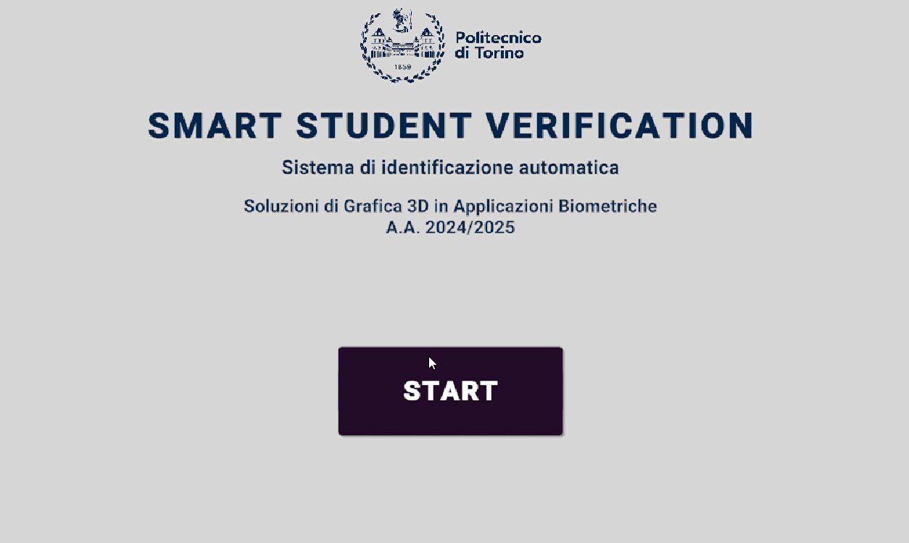
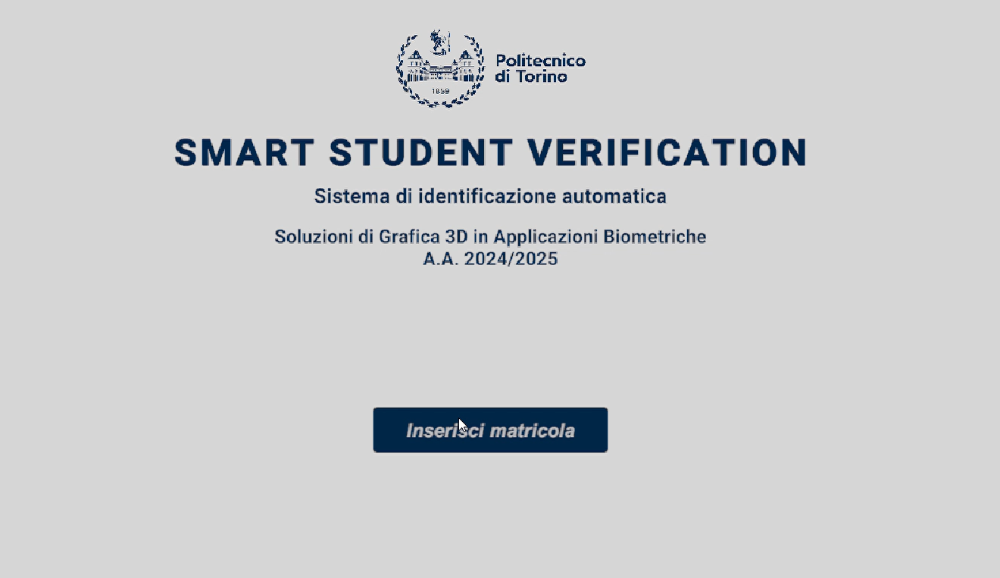
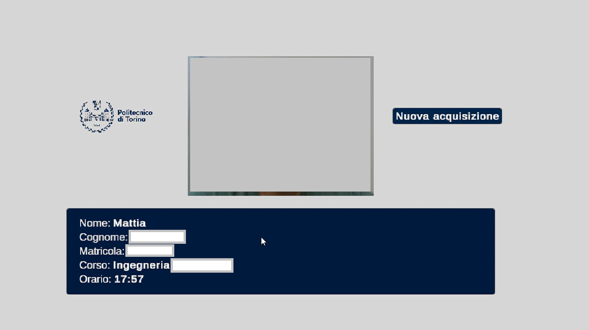
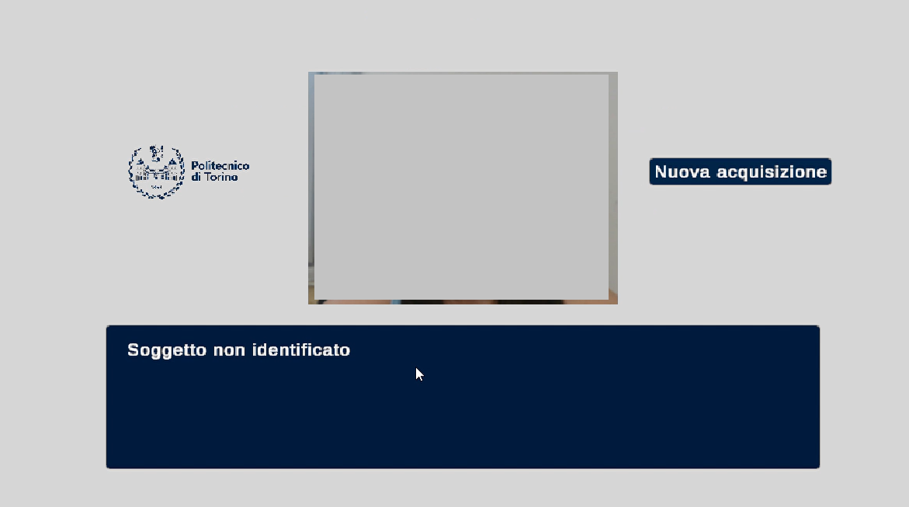

# Machine Learning-Based Face Verification for Exam Access Control

This project presents a real-time face verification system designed to automate student identity verification during university exams. The system combines RGB-D imaging, 3D facial landmark extraction, and classical machine learning techniques to provide a fast, contactless, and reliable alternative to manual check-in procedures.

The solution is built around a hybrid pipeline that integrates a Unity-based front-end with a Python back-end for facial recognition. The approach leverages geometric biometric features extracted from depth-aware 3D facial data, offering a practical and interpretable verification method suitable for real-world exam environments.

---

## Project Objectives

The system was developed to meet the following academic and technical goals:

- Replace traditional ID checks with a fast and secure face verification system.
- Ensure real-time performance and usability in realistic university settings.
- Maintain compatibility with RGB-D acquisition hardware and Unity-based user interfaces.
- Achieve interpretable classification using geometric features rather than black-box models.
- Provide modularity and scalability for integration with academic platforms.

---

## System Overview

The verification pipeline consists of four main components:

1. **Real-Time Data Acquisition**  
   The Unity front-end interfaces with an Intel RealSense RGB-D camera to capture a synchronized RGB frame and depth map. The user is prompted to enter a student ID, and the data is transmitted to the recognition back-end.

2. **3D Landmark Extraction and Feature Engineering**  
   On the Python side, MediaPipe is used to extract 2D facial landmarks from the RGB frame. Depth values from the aligned depth map are used to reconstruct 3D coordinates for 20 anatomically significant landmarks. A geometric feature vector is then computed based on Euclidean distances and a volumetric nose descriptor.

3. **Classification and Identity Matching**  
   A Support Vector Machine (SVM) classifier is trained on both the Bosphorus dataset and real-world samples. It associates each biometric signature with a unique student ID. Feature normalization and hyperparameter tuning ensure robust performance across different acquisition conditions.

4. **Real-Time Feedback and Metadata Display**  
   Classification results are sent back to Unity and displayed in real time, showing personalized student information (name, ID, course, exam time). Unidentified users are notified immediately, supporting quick decision-making during access control.

---

## Technologies Used

- **Python**: Classification, preprocessing, socket communication
- **Unity (C#)**: User interface, RealSense integration, frontend logic
- **Intel RealSense SR305**: RGB-D camera for depth-aware acquisition
- **MediaPipe**: Facial landmark extraction
- **Scikit-learn**: SVM training and evaluation
- **Bosphorus Dataset**: Benchmark dataset for 3D face recognition

---

## Results

The system was evaluated on a test set including both Bosphorus samples and real acquisitions using the Intel RealSense camera. Two expression types (neutral and happy) were considered. The key findings are:

- **Classification Accuracy (Mixed Expressions)**: 90.2%
- **Accuracy (Neutral Only)**: 94.1%
- **Intra-subject Feature Variability**: Generally below 1 cm
- **Real-time response**: Successful real-time metadata retrieval and display

These results demonstrate the effectiveness of 3D geometric features for identity verification in realistic conditions, even with expression-induced variability.

---

## Key Contributions

- A complete, modular, and low-cost pipeline for face verification in exam scenarios.
- Real-time integration between Unity and Python over socket communication.
- Use of RGB-D data for improved robustness and anti-spoofing.
- Feature design based on 3D distances and volumetric nose estimation.
- Benchmarking and fine-tuning across both public datasets and real-world samples.

---

## Limitations and Future Work

- **Expression Sensitivity**: Accuracy slightly decreases with smiling expressions; normalization or deep embeddings may improve invariance.
- **Data Diversity**: Real-world training data is currently limited; data augmentation could enhance generalization.
- **Lighting Conditions**: Partially controlled environments affect landmark stability; hardware adjustments or active illumination may help.
- **Ambiguity Resolution**: Subjects with similar features may still be misclassified; future work may explore confidence scores, fallback mechanisms, or multi-modal biometric fusion.

---

## Conclusion

This project demonstrates the feasibility of integrating RGB-D biometric recognition into academic settings, providing a contactless, interpretable, and extensible system for student identity verification. The combination of 3D landmarks, geometric features, and classical machine learning ensures both robustness and transparency, making it a suitable candidate for deployment in educational environments.

---

## System Screenshots

Below are representative screenshots illustrating the system's user interface and main stages during the face verification process:

### 1. Start Interface

The user launches the application in Unity and prepares for exam check-in.

---

### 2. Student ID Entry

The user is prompted to enter their institutional student ID before proceeding with the verification process.

---

### 3. Successful Verification

The system recognizes the student, and their personal and academic information is displayed on screen in real time.

---

### 4. Unverified Student

If the system fails to identify the student, a clear “Unidentified Student” message is shown, allowing for immediate manual handling.

